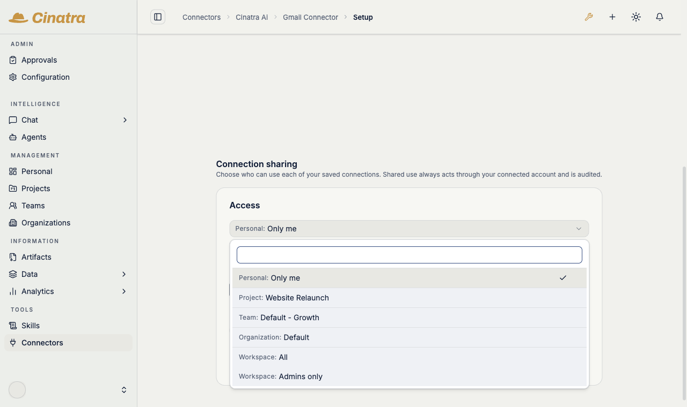
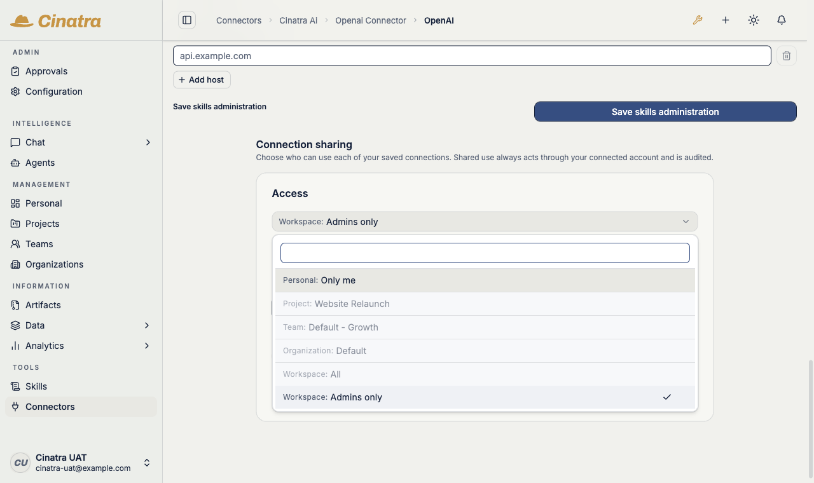
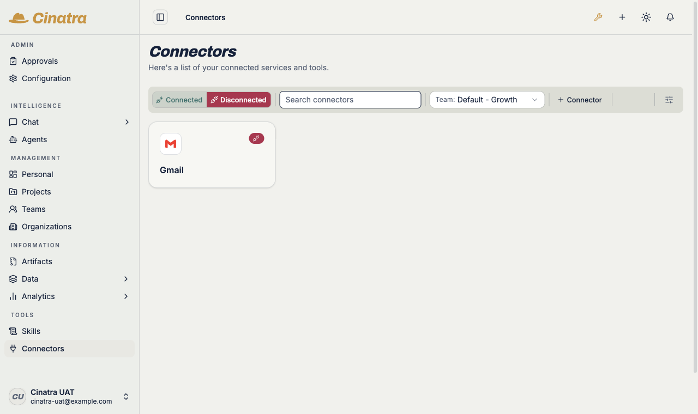

# Connections: scopes, sharing, and revocation

When you connect a connector to an external account — your Gmail, your GitHub, your company's WordPress — you create a **connection**. This page covers who can use that connection: the six access scopes, what sharing a connection actually means, what is recorded every time it is used, and how to take access back.

Two words matter throughout:

- A **connector** is the installed integration itself (the Gmail connector, the GitHub connector). Admins install connectors from the marketplace — see [Marketplace and extensions](marketplace-and-extensions.md).
- A **connection** is one linked external account inside a connector. It is **owned by the person who created it**, and the owner decides who may use it.

---

## The six access scopes

Every connection has exactly one access scope. The scope controls who may **use** the connection — whose agents can act through it. It never changes who *owns* it: the connection stays bound to its creator.

| Scope | Who can use the connection |
|---|---|
| **Personal** | Only you. Your agents use it; nobody else's do. |
| **Project** | Everyone in one specific project you belong to. |
| **Team** | Everyone in one specific team you belong to. |
| **Organization** | Everyone in one specific organization you belong to. |
| **Workspace** | Everyone on the instance. |
| **Admins only** | Only the organization's admins. Used for instance-level credentials such as the LLM-provider key connectors. |

Project, Team, and Organization grants always point at a **concrete** project, team, or organization picked from your own memberships — "Team" is never an abstract setting; it is *that* team.

*The scope picker on a Gmail connection, opened from the **Connection sharing** panel on the connector's page. All six scopes are offered — Personal ("Only me"), a concrete Project, a concrete Team, a concrete Organization, "Workspace: All", and "Workspace: Admins only" — with Gmail's recommendation, Personal, pre-selected.*

## Connecting: the recommended scope

When you connect an account, the new connection starts at a **recommended scope, pre-selected** in the scope picker — you'll find the picker in the **Connection sharing** panel on the connector's page. The recommendation comes from the connector's author — Gmail, for example, recommends **Personal**, because a mailbox is personal by nature.

The recommendation is only a starting point:

- You can freely pick a different scope at any time after connecting.
- A recommendation **never auto-shares anything**. A pre-selected "Team" recommendation still requires you to pick a concrete team and save; nothing changes until you do.
- A connector whose declaration names no scope behaves as if it recommended **Admins only** — the most conservative starting point, still yours to change. (Connectors that declare an *exclusive* scope are a different case — see [Locked connectors](#locked-connectors).)

## Locked connectors

Some connectors do not offer the full picker, because their author declared an **exclusive** scope:

- **Admin-only connectors** (for example the LLM-provider key connectors — OpenAI, Anthropic, Gemini) are locked to **Admins only**. The picker shows the scope locked, and the server independently rejects any broader grant — the locked picker is an affordance; the enforcement is the server's rejection.
- **Per-user-only connectors** are locked to **Personal** and can never be shared: the sharing controls are removed entirely, and the connection never appears in anyone else's listings.

*The locked picker on the OpenAI connector: the scope sits at "Workspace: Admins only", every broader option is greyed out, and the panel explains the lock — "Locked by this connector: access is limited to workspace admins (`only:"admin"`)". The lock is also enforced server-side.*

## What sharing really means

Sharing a connection does **not** copy your credential to anyone. It means: **other people's agents act through your account**.

Share your Gmail connection with your team and a teammate's outreach agent **sends email as you** — your address in the From line, your sent folder, your account's reputation. The same holds for any connector: a shared GitHub connection acts as your GitHub user; a shared CMS connection publishes as your CMS account.

Because of that, sharing is built around explicit owner consent and visibility:

- **Only the owner shares.** Nothing widens a connection's scope except a deliberate act by its owner.
- **Every use is recorded** — allowed *and* denied attempts — with who acted, that they acted through your connection, and in which run.
- **You can stop it at any time** (see [Taking access back](#taking-access-back)).

## Which connection an agent uses

When an agent needs a connector, the platform resolves a connection in a strict order:

1. **Your own connection first.** If the acting user has their own connection for that connector, it is used — a shared one is never silently preferred over your own.
2. **Otherwise, exactly one shared connection you're authorized to use.** If exactly one connection has been shared with a scope you're inside, the agent uses it — acting via its owner's account.
3. **More than one candidate: the run fails.** If several shared connections would match, the platform refuses to guess. The run stops with an actionable error telling you what to fix (typically: create your own connection, or have the owners narrow the overlapping shares). There is deliberately no "pick a connection" setting — a silent or sticky pick of someone else's account is exactly the surprise this model avoids.

## Who used my connection: the audit trail

Every use of your connection is recorded in the platform's audit trail, answering "who used my connection, and in which run?" — each record captures the acting user, the run, and the fact that the action was delegated through your connection. Denied attempts are recorded too, and the record is written before any external call is made. Credentials themselves are never written to the audit log.

A dedicated owner-facing usage view over these records is not in the product UI yet; on a self-hosted instance the records live in the platform's audit store, which your operator can query.

## Taking access back

You can revoke at three levels, from mildest to total:

- **Narrow the scope** — move a Team share back to Personal, or point it at a smaller group.
- **Remove a specific grantee** — drop one person's direct grant while leaving the rest.
- **Delete the connection** — removes the connection and revokes the stored credential with the upstream provider.

Revocation takes effect from the **next use**: credentials are resolved fresh on every use and are never cached across requests, so there is no lingering window where a revoked share keeps working. Runs already recorded in the audit trail remain there for review.

## Filtering /connectors by scope

The connectors page lets you filter by scope — Personal, a concrete Project, Team, or Organization, Workspace, Admins only. Each selection narrows the grid to the connectors whose connections are actually granted to that scope: pick your team and you see exactly what has been shared with that team, nothing broader. Use it to answer "what can my team's agents reach?" at a glance.

*The connectors page filtered by a concrete team ("Team: Default - Growth"): the grid narrows to exactly the connectors with a connection granted to that team.*

---

## Where to go next

- How connectors fit the wider capability fabric: [A connected ecosystem of capabilities](connected-ecosystem.md)
- The admin view — the access-policy model behind these grants, audits, and interventions: [Permissions](../admin/permissions.md)
- For connector authors — declaring the recommended or exclusive scope in `cinatra/config.json`: [Authoring connector extensions](../../references/platform/extension-kinds/authoring-connector-extensions.md#declaring-connection-access-scope--cinatraconfigjson)

Back to the [User Guide](README.md).
