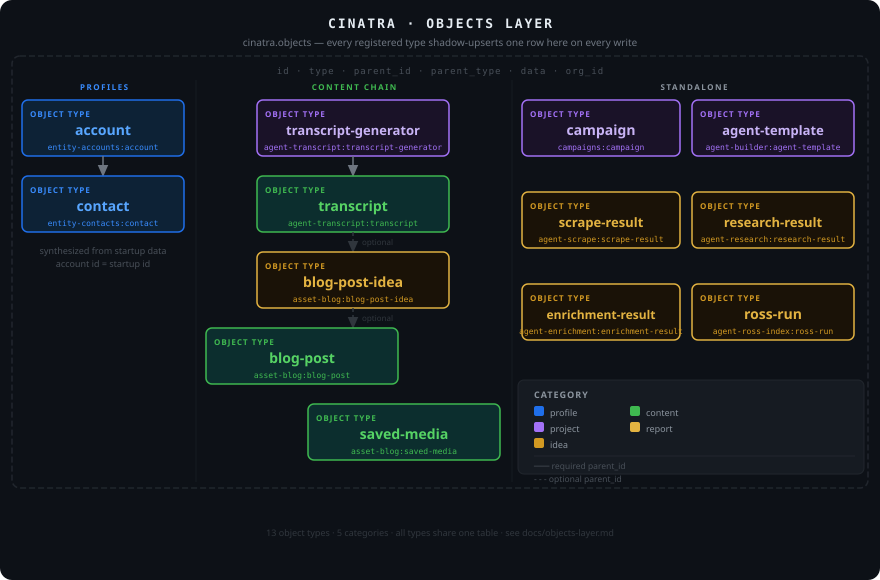

# Objects Layer

The **objects layer** is a unified JSONB shadow table (`cinatra.objects`) that provides a single queryable surface over every persistent object in Cinatra — regardless of which package stores it or what storage strategy that package uses internally.



---

## Why it exists

Cinatra packages own their own persistence: blob-keyed metadata, row-per-entity tables, or relational tables. This works well for per-package operations but makes cross-package queries (e.g. "show all objects created by this user", "find everything related to this campaign") expensive without a shared index.

`cinatra.objects` solves this with a fire-and-forget shadow write on every mutation. The primary store remains authoritative; the objects table is derived state that is always within one write of being current.

---

## Table schema

```sql
CREATE TABLE cinatra.objects (
  -- Base columns
  id          text        PRIMARY KEY,
  type        text        NOT NULL,          -- namespaced type id  (@scope/pkg:local)
  parent_id   text,                          -- self-FK; denormalised parent_type below
  parent_type text,
  data        jsonb       NOT NULL,          -- full object payload
  created_at  timestamptz NOT NULL DEFAULT now(),
  updated_at  timestamptz NOT NULL DEFAULT now(),
  created_by  text,                          -- better-auth user id
  org_id      text,                          -- organisation scope

  -- Provenance and lifecycle
  source                 text,               -- where the row came from (manual UI, agent run, import, …)
  agent_id               text,               -- agent that produced this row, when applicable
  run_id                 text,               -- specific run id, for agent-produced rows
  deleted_at             timestamptz,        -- soft-delete; rows with deleted_at IS NOT NULL are tombstoned
  classification_confidence real,            -- LLM classification confidence (0..1) when type was inferred

  -- Versioning and packaging
  package_version        text,               -- package version that produced this row
  agent_spec_version     text,               -- OAS spec version active at write time
  canonical_keys         text[],             -- per-type canonical identity keys (used for dedupe / upsert)
  external_id            text,               -- foreign-system identity, if any

  -- Derived index sync state
  graphiti_sync_status   text NOT NULL DEFAULT 'synced',  -- 'synced' | 'pending' | 'failed'
  exported_to            jsonb NOT NULL DEFAULT '{}'      -- per-channel export receipts
);
```

`ON CONFLICT (id) DO UPDATE` is used on every write, so all mutations are idempotent upserts and the table can be backfilled or re-backfilled at any time without producing duplicates.

---

## Object categories and types

Every registered type belongs to one of five categories. All type IDs are namespaced as `@cinatra-ai/<package>:<local-id>`:

| Category | Types | Notes |
|----------|-------|-------|
| **profile** | `@cinatra-ai/entity-accounts:account`, `@cinatra-ai/entity-contacts:contact` | Thin pointer rows for CRM identity records. Canonical records live in Twenty CRM and are reached via the `crm_*` MCP facade; cinatra holds only the pointer needed for substrate scoping and Graphiti projection. |
| **project** | `@cinatra-ai/assets:blog-project`, `@cinatra-ai/campaigns:campaign`, `@cinatra-ai/campaigns:context`, `@cinatra-ai/agent-builder:agent-template`, `@cinatra-ai/lists:list` | Long-lived containers that group child objects (a blog pipeline project, a campaign, a list of recipients, a saved agent template). The `lists:list` schema is registered by the CRM connector. |
| **idea** | `@cinatra-ai/assets:blog-idea` | Intermediate creative stage produced by the blog agent. |
| **content** | `@cinatra-ai/assets:blog-post` | Published or publishable outputs. |
| **report** | `@cinatra-ai/campaigns:recipients`, `@cinatra-ai/objects:object` | Agent-produced outputs; `objects:object` is the fallback type for anything not registered to a more specific one. |

Extensions can register their own object types at startup (see `objectTypeRegistry.register` in `@cinatra-ai/objects`). The list above describes the first-party types that ship with the platform; an instance with additional installed extensions will see more.

### Parent-child hierarchy

```
account
  └── contact

blog-post-idea                (idea)
  └── blog-post               (content, optional parent)

saved-media                   (content, no parent)
campaign                      (project, no parent)
campaigns:context             (project, no parent)
agent-template                (project, no parent)
list                          (project, no parent)
campaigns:recipients          (report, no parent in objects)
```

`parent_id` / `parent_type` are nullable. Objects without a registered parent (reports, top-level projects) store `NULL`.

---

## Dual-write hooks

Every package that owns a registered type calls `shadowUpsertObject()` from `src/lib/objects-dual-write.ts` on every mutating store operation:

```typescript
// src/lib/objects-dual-write.ts
import "server-only";
import { upsertObject, type UpsertObjectInput } from "@/lib/objects-store";

export function shadowUpsertObject(input: UpsertObjectInput): void {
  try {
    upsertObject(input);       // fire-and-forget — not awaited
  } catch (error) {
    console.error(
      `[objects:shadow-write] type=${input.type} id=${input.id ?? "(auto)"} failed:`,
      error,
    );
  }
}
```

Key properties:
- **Never throws** — a failed shadow write is logged and swallowed; the primary store write is unaffected.
- **Fire-and-forget** — `upsertObject` is not awaited; latency impact on the calling operation is negligible.
- **Idempotent** — `ON CONFLICT (id) DO UPDATE SET type = EXCLUDED.type, data = EXCLUDED.data, ...` so any operation is safe to replay.
- **Type updates on conflict** — `type` is included in the update clause, so an id that transitions between types (e.g. startup → account) is correctly re-typed on the next write.

### Hook sites

| Store file | Types written |
|------------|---------------|
| `@cinatra-ai/crm-connector/src/integration/register-object-types.ts` | `@cinatra-ai/entity-accounts:account`, `@cinatra-ai/entity-contacts:contact`, `@cinatra-ai/lists:list` (the three CRM pointer types — formerly split across three deprecation-stub packages, now consolidated) |
| `src/lib/blog/integration/register-object-types.ts` | `@cinatra-ai/assets:blog-project`, `@cinatra-ai/assets:blog-idea`, `@cinatra-ai/assets:blog-post` |
| `packages/agents/src/integration/register-object-types.ts` | `@cinatra-ai/agent-builder:agent-template` |
| `packages/objects/src/integration/register-types.ts` | `@cinatra-ai/objects:object`, `@cinatra-ai/campaigns:campaign`, `@cinatra-ai/campaigns:context`, `@cinatra-ai/campaigns:recipients` |

Outputs that agent runs produce — contact discovery batches, generated content drafts, miscellaneous run artifacts — flow through these registered types, typically attached to a `@cinatra-ai/lists:list` or written as a generic `@cinatra-ai/objects:object`, rather than each agent registering its own bespoke result type. Per-run provenance (the agent id and run id that produced the row) is stamped on the object via the AsyncLocalStorage-based propagation set up at run start.

---

## Backfill

One-shot backfill scripts populate the table from existing primary-store data. Safe to re-run on any database at any time.

```bash
pnpm backfill:objects          # all directly-stored first-party types
pnpm backfill:objects:entities # synthesized contacts + accounts
pnpm verify:objects-counts     # side-by-side count comparison
```

---

## Type registration

Each package registers its object types with `objectTypeRegistry` from `@cinatra-ai/objects` at startup. The registry holds the Zod schema, category, lifecycle rules, renderers, and relation declarations for each type.

```typescript
import { objectTypeRegistry } from "@cinatra-ai/objects";

objectTypeRegistry.register({
  type: "@cinatra-ai/assets:blog-post",
  category: "content",
  schema: blogPostSchema,
  lifecycle: { sources: ["agent", "user"], mutableBy: ["agent", "user"] },
  renderers: { listRow: BlogPostListRow, card: BlogPostCard, detail: BlogPostDetail },
});
```

Type IDs use the `@scope/package:local-id` namespace format enforced by `OBJECT_TYPE_NAMESPACE_RE`.

> **Renderer boundary — moving off host-side registration (epic [#1620](https://github.com/cinatra-ai/cinatra/issues/1620)).** Historically the host owned every type's view: the `renderers` above were registered host-side and core carried per-type UI knowledge. That inverts the intended boundary — **core should own dispatch, the shell, and the never-blank floor; an artifact extension should ship its own type's view.** For artifact **types**, the `detail`/`preview` view now ships from the type's own extension through the `cinatra.artifact.ui` block and resolves through the generated renderer map (`src/lib/generated/artifact-renderers.ts`) plus org-scoped arbitration registries (`src/app/artifacts/[id]/renderer-resolution.ts`) — **not** a host-side `renderers` registration keyed by a concrete type id. The `listRow` / `card` slots remain host-owned for now and are **reserved** in the `cinatra.artifact.ui` v1 enum pending later migration waves. Core is converging on treating type identity as **opaque**; a CI boundary gate **will forbid** production-core code keyed by a concrete type id for type-specific presentation. Treat the host-side `renderers` block below as the **transitional** shape for not-yet-migrated types, not the end-state contract.

---

## Querying the objects table

### From server components

Use `readAllObjects()` from `src/lib/objects-store.ts` to query across all or a filtered subset of types. Pair it with `registerAllObjectTypes()` from `src/lib/register-all-object-types.ts` to ensure the registry is populated before resolving renderers.

```typescript
import { readAllObjects } from "@/lib/objects-store";
import { registerAllObjectTypes, ASSET_TYPE_IDS } from "@/lib/register-all-object-types";
import { objectTypeRegistry } from "@cinatra-ai/objects";
import { hasReactRenderers } from "@cinatra-ai/objects/renderer-types";

// Ensure all registered types are loaded (idempotent)
registerAllObjectTypes();

// Fetch — optionally filter by type IDs
const objects = readAllObjects({ typeIds: Array.from(ASSET_TYPE_IDS) });

// Render via each type's listRow renderer
objects.map((obj) => {
  const def = objectTypeRegistry.resolve(obj.type);
  if (!def || !hasReactRenderers(def)) return null;
  const ListRow = def.renderers.listRow;
  return <ListRow value={obj.data as Record<string, unknown>} />;
});
```

`readAllObjects` is limited to 200 rows per call. Use the `typeIds` filter to stay within relevant scope.

### Family helper sets

`src/lib/register-all-object-types.ts` exports two pre-built sets for filtering by UI family:

| Export | Contents |
|--------|----------|
| `ASSET_TYPE_IDS` | The set of asset-family type IDs used for `?family=assets` filtering (blog projects, blog ideas, blog posts) |
| `ENTITY_TYPE_IDS` | The set of registered entity-family type IDs used for `?family=entities` filtering (contacts, accounts) |
| `OBJECT_TYPE_NEW_URLS` | Creation route per type (used by `/objects/new` chooser) |

---

## UI

The unified workspace surface lives in the sidebar's **Information → Data** group.

- `/data` — unified list page showing all objects across registered types, filterable by `?family=assets`, `?family=entities`, or `?type=<typeId>`. Each row is rendered via the type's registered `listRow` renderer.
- `/data/types` — type chooser browse view.
- `/assets` and similar family-scoped routes remain reachable as typed entry points; they read from the same underlying `objects` table and surface only their family. CRM rows (account / contact / list) have no cinatra-side browse — agents and humans interact with them through the `crm_*` MCP facade (Twenty is the source of truth).
- `/data?family=...` — primary objects browser (workspace-scoped). The former cross-org diagnostics view has been retired; type-registry inspection happens through the live data browser and MCP `objects_*` primitives.

All sub-routes (detail, edit, new) under typed paths are unchanged — they read and write through the same Objects layer.

---

## Related

- [Architecture](architecture.md) — full platform architecture
- `src/lib/objects-store.ts` — `upsertObject`, `readAllObjects`, `readObjectsByType`, `ObjectRecord`
- `src/lib/objects-dual-write.ts` — `shadowUpsertObject` helper
- `src/lib/register-all-object-types.ts` — `registerAllObjectTypes`, family sets, creation URL map
- `packages/objects/src/` — registry, type definitions, category taxonomy
