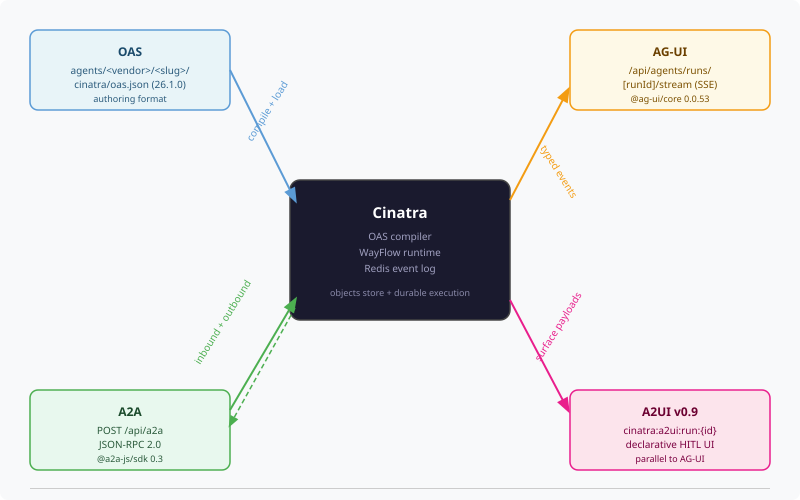

# Open Standards in Cinatra

Cinatra speaks four open agent standards so that agents authored in Cinatra are not locked to Cinatra, and so that agents authored elsewhere can plug in without bespoke integration:

- **OAS (Open Agent Specification / agentspec)** — how an agent is declared
- **A2A (Agent-to-Agent Protocol)** — how agents are called over the wire
- **AG-UI (Agent-User Interaction Protocol)** — how a running agent streams lifecycle events to clients
- **A2UI (Agent-to-User Interface)** — how an agent declares the UI surface a human sees during human-in-the-loop pauses

What this document covers, for each standard: what it is, where the canonical spec lives, who maintains it, where Cinatra implements it (with file references), and what concrete interoperability that buys.

A note on versions: the listed protocol/spec versions are what Cinatra implements today. They may lag the latest published versions of each spec — see the per-standard "Version Cinatra implements" rows in the [endpoint and version matrix](#endpoint-and-version-matrix) below.

---

*Four open standards, four interfaces. OAS files arrive in `agents/<vendor>/<slug>/` and are compiled into the runtime; external callers reach the platform over A2A; AG-UI streams typed lifecycle events back out over server-sent events (SSE); A2UI publishes declarative human-in-the-loop (HITL) surfaces on a separate Redis channel that runs in parallel to AG-UI.*

---

## A2A — Agent-to-Agent Protocol

### What it is

A2A is an open HTTP/JSON-RPC protocol for agent interoperability. It defines how any HTTP client — including another agent — invokes an A2A-compliant agent: discovers the agent's capabilities via an [AgentCard](https://a2a-protocol.org/latest/specification/), sends a task, streams progress as SSE events, resumes runs paused at a human-in-the-loop gate, and cancels in-flight tasks. The transport is HTTP; the payload is JSON-RPC 2.0.

### Official references

- Protocol home: <https://a2a-protocol.org>
- Specification: <https://a2a-protocol.org/latest/specification/>
- JavaScript/TypeScript SDK: [`@a2a-js/sdk` on npm](https://www.npmjs.com/package/@a2a-js/sdk)
- Python SSE runtime [`fasta2a`](https://github.com/datalayer/fasta2a) — used inside the WayFlow (Cinatra's OAS Flow agent runtime) container

### Industry support

A2A was originally proposed by Google and is now developed under the Linux Foundation. The protocol is supported by a broad set of enterprise software vendors and agent-framework projects — see the partners page at <https://a2a-protocol.org>.

### How Cinatra uses A2A

Cinatra exposes both an inbound and an outbound A2A surface. Inbound, a single JSON-RPC endpoint accepts authenticated calls and routes them to the right agent — gated behind the `CINATRA_A2A_HTTP_ENABLED` flag so production deployments opt in explicitly, with an `A2A_DEV_BYPASS` loopback escape hatch for local development. A second endpoint resumes runs paused at a human-in-the-loop gate, and per-agent sub-routes serve `AgentCard` descriptors for capability discovery while forwarding execution traffic to the WayFlow container that hosts the agent. Authorization uses the same Bearer JSON Web Token (JWT) the MCP server issues.

Outbound, an A2A client lets Cinatra call remote A2A agents as if they were local tools — so a remote agent shows up alongside in-process tools and Cinatra-hosted agents in the same compose surface. SSE plumbing, event log persistence to Redis Streams, and the dual inbound/outbound proxying are implemented in the `@cinatra-ai/a2a` package.

Inside the WayFlow container, the `[a2a]` extra of `wayflowcore` activates `fasta2a`, which means every flow Cinatra publishes is automatically an A2A-compliant agent without per-agent wiring.

### Why it benefits Cinatra

External systems — third-party agents, large language model (LLM) orchestrators, custom dashboards — can call any Cinatra agent over standard HTTP without a Cinatra-specific SDK. The same outbound client lets Cinatra call any remote A2A agent as a local tool, so adding a remote skill does not require per-vendor integration code. Because the protocol is symmetric, the agent mesh works in both directions: Cinatra is both a provider and a consumer of A2A endpoints.

---

## AG-UI — Agent-User Interaction Protocol

### What it is

AG-UI is an open protocol for streaming agent lifecycle events from a server to a client over SSE. It defines a typed event vocabulary — `RUN_STARTED`, `TEXT_MESSAGE_START`, `TEXT_MESSAGE_CONTENT`, `TEXT_MESSAGE_END`, `TOOL_CALL_START`, `TOOL_CALL_END`, `STATE_SNAPSHOT`, `INTERRUPT`, `RESUME`, `RUN_FINISHED`, `RUN_ERROR` — that any AG-UI-aware client can consume to render real-time agent progress. The protocol is decoupled from any particular agent runtime or UI framework.

### Official references

- Documentation: <https://docs.ag-ui.com>
- npm package: [`@ag-ui/core`](https://www.npmjs.com/package/@ag-ui/core) — Cinatra pins `0.0.53` in `packages/agent-ui-protocol/package.json`

### Industry support

AG-UI is maintained by the ag-ui-protocol open source project. Integrations across multiple agent frameworks are listed at <https://docs.ag-ui.com>.

### How Cinatra uses AG-UI

Every running agent emits typed AG-UI events from the execution worker into a durable Redis Streams log. Browser clients subscribe to a per-run SSE endpoint with `Content-Type: text/event-stream` and a `Last-Event-ID` resume header — a disconnected client reconnects exactly where it left off, with no missed events. Authorization uses the standard session and per-run ownership check.

A dual adapter at the emission point fans every lifecycle hook out to two adapters in parallel: one writes AG-UI events to the log; the other publishes any HITL surface payloads to the A2UI channel. That keeps the two streams consistent without callers having to dispatch twice.

For external integrations, AG-UI events can also be multiplexed inline into A2A SSE responses by setting `CINATRA_AGUI_EXTERNAL_ENABLED=true`. This is off by default — most external callers fetch the dedicated browser stream rather than the A2A multiplex.

The event vocabulary itself is pinned to `@ag-ui/core@0.0.53` so types and constants stay aligned with the upstream protocol.

### Why it benefits Cinatra

Any AG-UI-aware client — the Cinatra web app, third-party agent dashboards — can subscribe to a run and render progress without Cinatra-specific glue. The Redis Streams-backed log means a disconnected client reconnecting with `Last-Event-ID` resumes exactly where it left off, with no missed events. The `INTERRUPT` and `RESUME` events provide a standard hook for HITL flows regardless of which runtime produced them.

---

## A2UI — Agent-to-User Interface

### What it is

A2UI is a declarative payload format that describes the UI surface an agent renders during a human-in-the-loop pause: setup forms before a run starts, mid-run review panels for things like recipient selection or email drafts, and confirmation surfaces before destructive actions. Cinatra implements **A2UI v0.9**. The payload describes the surface in terms of catalog renderer IDs, component layouts, and a typed data model — leaving the rendering itself to the client.

A2UI is distinct from, and runs in parallel to, AG-UI. AG-UI carries lifecycle events; A2UI carries the declarative HITL UI content. A single dispatch in the execution worker emits both via a shared dual adapter, so the two streams stay consistent without callers having to dispatch twice.

### Official references

A2UI v0.9 is consumed inside Cinatra; no public canonical URL was confirmed at the time of writing.

### Industry support

A2UI is implemented locally as the parallel HITL channel that AG-UI references. External maintainers / working-group members could not be confirmed at the time of writing — the spec is consumed as an internal protocol within the Cinatra platform.

### How Cinatra uses A2UI

When an agent declares HITL screens in its OAS file, Cinatra carries those declarations through to runtime as A2UI v0.9 messages — `createSurface`, `updateComponents`, `updateDataModel`. A translator turns the agent's high-level HITL metadata (setup groups, output hints, xRenderer dispatch keys) into concrete surface payloads at the point the agent pauses.

Delivery is a dual-write. Each A2UI message is appended to the unified Redis Streams event log with a `channel: "a2ui"` field, which lets any AG-UI-aware client replay both streams together and filter by channel. The same message is also published on a dedicated pub/sub channel for low-latency UI updates, so a focused approval inbox can subscribe just to HITL traffic without the AG-UI lifecycle noise.

The translator only knows about catalog renderer IDs; rendering itself is the client's responsibility. The result is that the same approval form component works for any agent that declares the same renderer ID — adding a new agent does not require new bespoke React surfaces.

### Why it benefits Cinatra

HITL surfaces are declared in the OAS file as catalog renderer IDs — not wired per agent as one-off React components. Any A2UI-aware renderer can display the surface without knowing which agent produced it, so the same review form component works for any agent that declares the same renderer ID. Because A2UI publishes on its own channel, a client that only cares about HITL UI (for example, a focused approval inbox) can subscribe to `cinatra:a2ui:run:{runId}` and ignore the AG-UI lifecycle traffic.

---

## OAS — Open Agent Specification (agentspec)

### What it is

OAS, also called agentspec, is a declarative JSON format for describing an agent's structure: its inputs, system prompt, tool references, flow control nodes, output schema, approval gates, and HITL renderer declarations. Cinatra agents are authored as compact OAS Flow files at version `26.1.0` with `component_type: "Flow"`. A compiler translates the compact authoring format into the runtime representation the platform executes.

### Official references

- Spec home: <https://oracle.github.io/agent-spec/>
- Reference runtime: [`wayflowcore` on PyPI](https://pypi.org/project/wayflowcore/)
- Python validator: [`pyagentspec`](https://pypi.org/project/pyagentspec/) — sub-dependency of `wayflowcore`; pinned explicitly in `docker/wayflow/Dockerfile` to avoid validator drift

### Industry support

Oracle is the publishing organization for the Open Agent Specification and the WayFlow reference runtime, as listed on the project's homepage at <https://oracle.github.io/agent-spec/>.

### How Cinatra uses OAS

Every agent in Cinatra is a directory under `agents/<vendor>/<slug>/cinatra/` containing an `oas.json` file. The file is the agent — input schema, system prompt, tool references, flow control nodes, output schema, approval gates, and HITL renderer declarations all live there. There is no parallel Cinatra-specific author format.

At publish time a compiler reads the compact OAS Flow authoring format and derives the runtime representation: `inputSchema`, `outputSchema`, `approvalPolicy`, and the compiled execution plan all come out of the node graph automatically. A validator rejects legacy fields before the compiler runs, so the on-disk format stays canonical. The compiled output is what WayFlow loads and executes inside the Docker container.

The WayFlow runtime itself is pinned to `wayflowcore[a2a]==26.1.2` together with `pyagentspec==26.1.2` — both must move together or the validator drifts.

### Why it benefits Cinatra

Agents authored in OAS Flow are loadable by any runtime that implements the `26.1.0` spec, not only Cinatra — the OAS file carries everything needed for inputs, prompts, tools, and flow control. Conversely, OAS agents authored by third parties can be installed into Cinatra if their `oas.json` validates against the same spec version and their HITL renderer IDs resolve in Cinatra's catalog. The compiler's explicit derivation rules mean authors do not need to manually maintain parallel fields: `inputSchema`, `outputSchema`, and `approvalPolicy` are always derived from the flow node graph.

The portability is real but conditional. See [Portability — what travels and what doesn't](#portability--what-travels-and-what-doesnt) below for the qualifiers.

---

## How the four standards compose

The four standards form a layered stack:

| Layer | Standard | Role |
|-------|----------|------|
| Specification | OAS | Defines what the agent is: inputs, prompt, tools, flow nodes, HITL renderer declarations |
| Execution transport | A2A | Inbound calls into Cinatra agents; outbound calls from Cinatra to remote agents |
| Lifecycle events | AG-UI | Streams typed events (`RUN_STARTED`, `TEXT_MESSAGE_CONTENT`, `INTERRUPT`, …) over SSE |
| HITL surfaces | A2UI | Declarative UI payloads published on a parallel Redis channel during `pending_approval` |

Concretely: an agent is authored as an OAS Flow file and compiled to its runtime representation at publish time. An external caller reaches it over A2A, either through the main JSON-RPC endpoint (gated by `CINATRA_A2A_HTTP_ENABLED`) or through a per-agent proxy route that discovers the agent via its `AgentCard` and forwards execution traffic to the WayFlow container.

As the agent runs, a single dispatch fans every lifecycle hook out to two adapters: AG-UI typed events go to the durable Redis Streams event log (which the browser SSE endpoint reads, with `Last-Event-ID` resume), and any HITL surface payloads go to the parallel A2UI pub/sub channel `cinatra:a2ui:run:{runId}` plus the same event log tagged with `channel: "a2ui"`.

When the agent pauses for human approval, an AG-UI `INTERRUPT` event marks the pause, the matching A2UI message describes the form to render (`createSurface` / `updateComponents` / `updateDataModel`), and once the user acts, a dedicated resume endpoint feeds the decision back into the run.

---

## Endpoint and version matrix

| Standard | Cinatra version | Endpoint(s) | Auth | Feature flag |
|----------|-----------------|-------------|------|--------------|
| A2A | `protocolVersion: "0.3.0"` via [`@a2a-js/sdk@^0.3.13`](https://www.npmjs.com/package/@a2a-js/sdk) | `POST /api/a2a` (multiplexed JSON-RPC) — flag-gated; `POST /api/a2a/resume` — flag-gated; `GET /api/a2a/agents/<vendor>/<slug>` (AgentCard + per-agent JSON-RPC proxy) — **always on** | Bearer JWT (same as MCP); dev loopback bypass via `A2A_DEV_BYPASS=true` | `POST /api/a2a` requires `CINATRA_A2A_HTTP_ENABLED=true`; the AG-UI multiplexed SSE response inside `/api/a2a` requires `CINATRA_AGUI_EXTERNAL_ENABLED=true`. Per-agent routes (`/api/a2a/agents/<vendor>/<slug>`) are always reachable so any A2A client that discovers an agent via its `AgentCard` can call it directly without flipping a flag. |
| AG-UI | [`@ag-ui/core@0.0.53`](https://www.npmjs.com/package/@ag-ui/core) | `GET /api/agents/runs/{runId}/stream` (canonical browser SSE, `Last-Event-ID` resume) | Better Auth (the auth server library Cinatra uses) session + per-run ownership | always on for the browser route; `CINATRA_AGUI_EXTERNAL_ENABLED=true` to also multiplex AG-UI into the A2A SSE response for external A2A callers |
| A2UI | `v0.9` | Redis Streams `cinatra:a2a:events:{runId}` (field `channel: "a2ui"`); Redis pub/sub `cinatra:a2ui:run:{runId}` | inherits AG-UI auth (same actor/run scope) | none — emitted whenever the dual-adapter sees an A2UI-relevant hook |
| OAS | `agentspec_version: "26.1.0"`, `component_type: "Flow"`, runtime [`wayflowcore[a2a]==26.1.2`](https://pypi.org/project/wayflowcore/) + [`pyagentspec==26.1.2`](https://pypi.org/project/pyagentspec/) | n/a (file format, not an endpoint) | n/a | n/a |

Cinatra's A2A version (`0.3.0`) lags the current published spec — adopters that target only the latest A2A version may need a compatibility layer. The pinned `wayflowcore` runtime requires `pyagentspec==26.1.2` exactly to avoid validator drift; updating either alone breaks IME validation.

---

## Portability — what travels and what doesn't

The standards-aligned design makes a lot portable, but "portable" has limits that adopters should know before relying on them.

**What travels with an OAS file:**

- Inputs, system prompt, tool references, flow control nodes, output schema
- `approvalPolicy` derived from the node graph
- HITL renderer IDs (as strings in `hitlScreens`)
- Per-step skill matching declarations (Cinatra-specific extensions live under `metadata.cinatra` and are ignored by spec-only runtimes)

**What does not travel automatically:**

- HITL renderer IDs only resolve if the receiving runtime has a renderer registered for the same ID
- Cinatra-specific fields under `metadata.cinatra` (vendor namespace, package name, instance bindings)
- Auth: each runtime issues its own session/token; OAS does not carry credentials
- Tool implementations: `tools` references identify the tool but the receiving runtime must provide an implementation
- A2A SDK / protocol version compatibility (see matrix above)

**Forward direction (Cinatra → external):** any spec-only OAS runtime can load a Cinatra-authored OAS file and run the flow, as long as the runtime supports `agentspec_version: "26.1.0"` and the referenced tools exist on that side. HITL renderers will likely no-op or fall back to a default.

**Reverse direction (external → Cinatra):** an external OAS Flow installs into Cinatra if (1) the file validates against the `26.1.0` schema, (2) referenced tools resolve to Cinatra MCP primitives or A2A endpoints, and (3) any `hitlScreens` renderer IDs resolve in Cinatra's renderer catalog (or are accepted as no-op).

---

## Further reading

- AG-UI + A2UI internals: `packages/agent-ui-protocol/src/`
- A2A package source: `packages/a2a/src/`
- The MCP server that complements these standards: [The external MCP server](../mcp/external-server.md)
